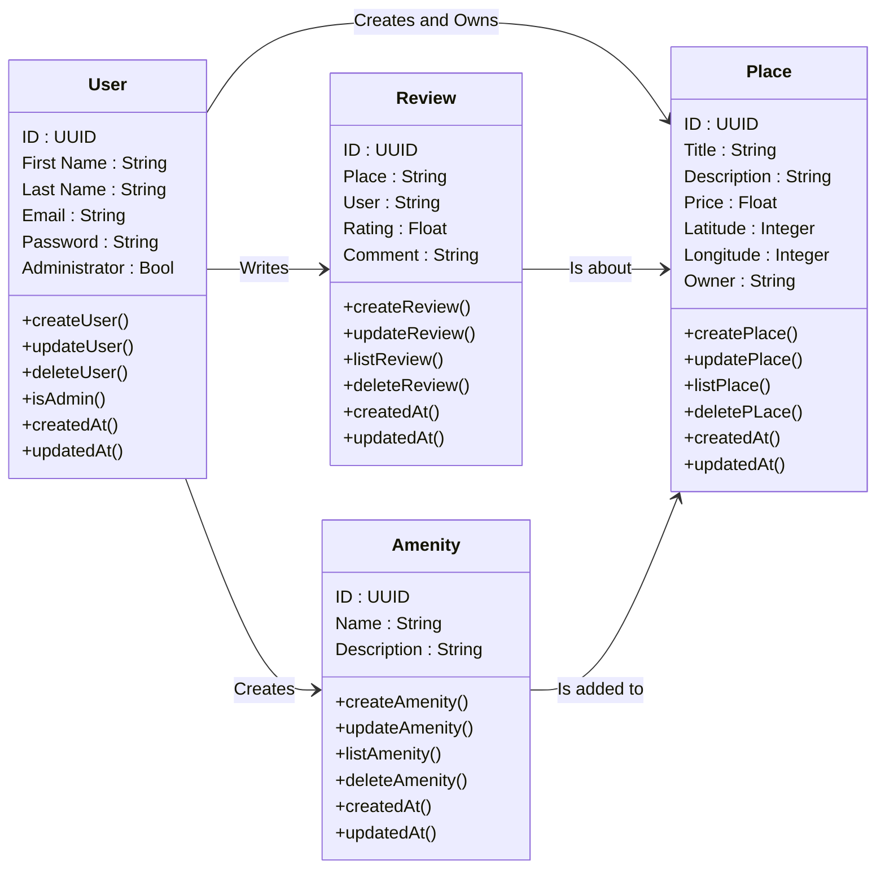

```mermaid
classDiagram

    class User {
    ID : UUID
    First Name : String
    Last Name : String
    Email : String
    Password : String
    Administrator : Bool
    +createUser()
    +updateUser()
    +deleteUser()
    +isAdmin()
    +createdAt()
    +updatedAt()
    }

class Place {
    ID : UUID
    Title : String
    Description : String
    Price : Float
    Latitude : Integer
    Longitude : Integer
    Owner : String
    +createPlace()
    +updatePlace()
    +listPlace()
    +deletePLace()
    +createdAt()
    +updatedAt()
    }

    class Review {
    ID : UUID
    Place : String
    User : String
    Rating : Float
    Comment : String
    +createReview()
    +updateReview()
    +listReview()
    +deleteReview()
    +createdAt()
    +updatedAt()
    }

    class Amenity {
    ID : UUID
    Name : String
    Description : String
    +createAmenity()
    +updateAmenity()
    +listAmenity()
    +deleteAmenity()
    +createdAt()
    +updatedAt()
    }

direction LR
User --> Place : Creates and Owns
User --> Review : Writes
User --> Amenity : Creates
direction TB
Review --> Place : Is about
direction LR
Amenity --> Place : Is added to


```