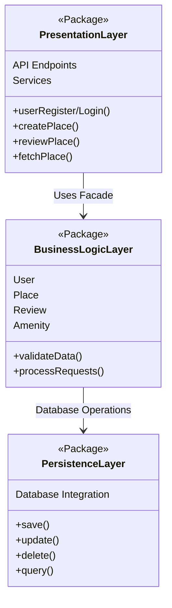
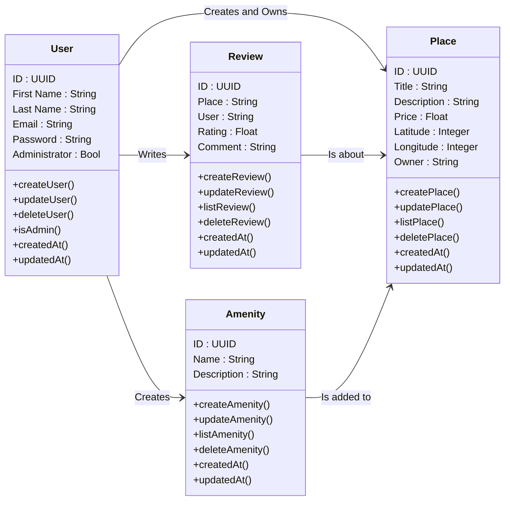
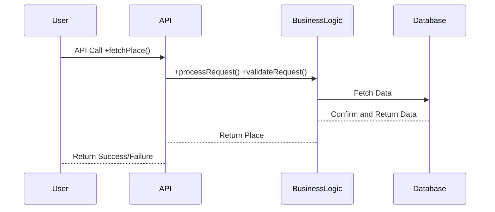
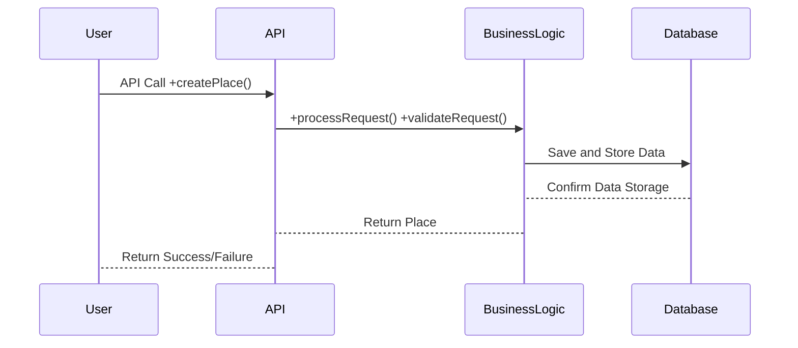
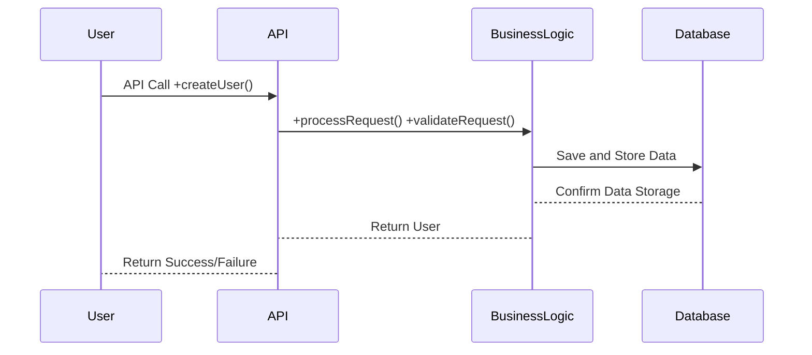
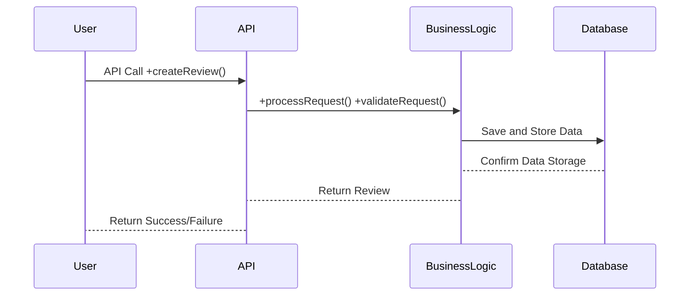

## **Technical Documentation**

---

## **1. Introduction**

### **Purpose of the Document**
This technical document serves as a **blueprint** for the development of the **HBnB Evolution** project, an **Airbnb-like application**. It provides a structured overview of the system’s architecture, detailing its core components, their interactions, and the rationale behind design decisions. The document will act as a reference for developers, ensuring a clear and guided implementation process.

### **Project Overview**
HBnB Evolution is a **modular, service-oriented application** that enables users to **list, review, and book places**. The system is structured using a **three-layered architecture**:
- **Presentation Layer** – Handles API interactions.
- **Business Logic Layer** – Manages core functionality using a **facade pattern**.
- **Persistence Layer** – Ensures **data storage and retrieval**.

The following sections will provide a detailed breakdown of the system’s architecture, business logic, and API interactions.

---

## **2. High-Level Architecture**

### **2.1 High-Level Package Diagram**

### **2.2 Explanation**
- **Presentation Layer**: Provides API endpoints for users to interact with the system.
- **Business Logic Layer**: Uses a **Facade Pattern** to streamline API requests.
- **Persistence Layer**: Stores all user, place, review, and amenity data in the database.

---

## **3. Business Logic Layer**

### **3.1 Class Diagram**

### **3.2 Explanation**
- **User**: Manages authentication and permissions.
- **Place**: Represents listings with location and pricing details.
- **Review**: Allows users to rate and comment on places.
- **Amenity**: Describes amenities associated with a place.

---

## **4. API Interaction Flow**

### **4.1 Sequence Diagrams**

#### **Fetching a Place**

#### **Creating a Place**

#### **Creating a User**

#### **Creating a Review**

---

## **5. Conclusion**
This document provides a **comprehensive technical guide** for the **HBnB Evolution** project. It defines the **architecture, business logic, and API interactions**, ensuring a structured and scalable development process.

By following these guidelines, developers can effectively implement and expand HBnB Evolution with **minimal technical debt** and **efficient code management**.

---

