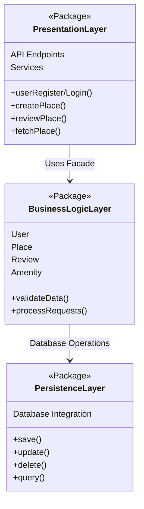

```mermaid
classDiagram
    class PresentationLayer {
    <<Package>>
    API Endpoints
    Services
    +userRegister/Login()
    +createPlace()
    +reviewPlace()
    +fetchPlace()
    }
PresentationLayer --> BusinessLogicLayer : Uses Facade
    class BusinessLogicLayer {
    <<Package>>
    User
    Place
    Review
    Amenity
    +validateData()
    +processRequests()
    }
BusinessLogicLayer --> PersistenceLayer : Database Operations
    class PersistenceLayer {
    <<Package>>
    Database Integration
    +save()
    +update()
    +delete()
    +query()
    }
```