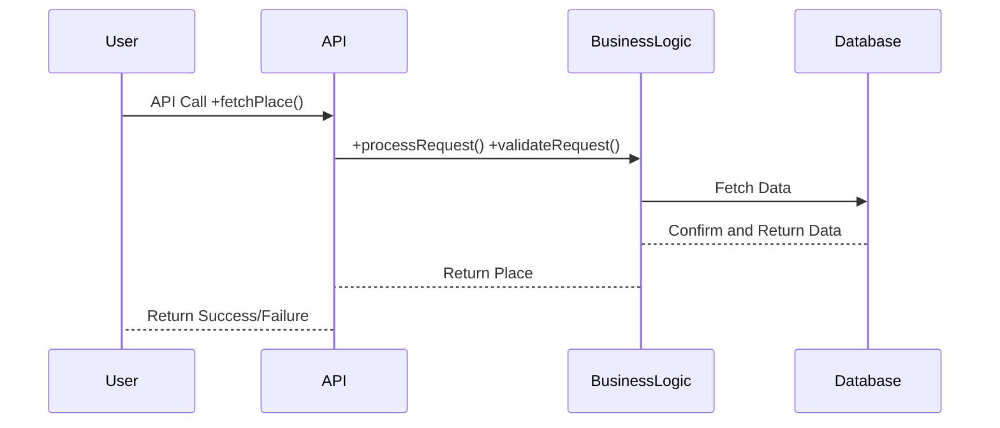

```mermaid
sequenceDiagram

participant User
participant API
participant BusinessLogic
participant Database

User->>API: API Call +fetchPlace()
API->>BusinessLogic: +processRequest() +validateRequest()
BusinessLogic->>Database: Fetch Data
Database-->BusinessLogic: Confirm and Return Data
BusinessLogic-->API: Return Place
API-->User: Return Success/Failure
```